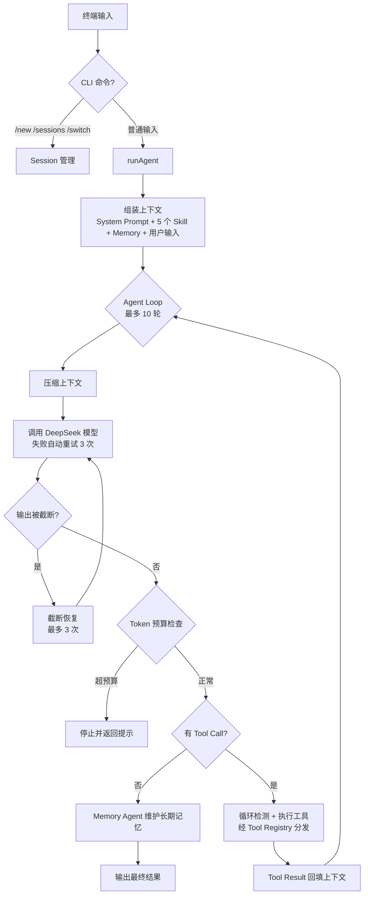
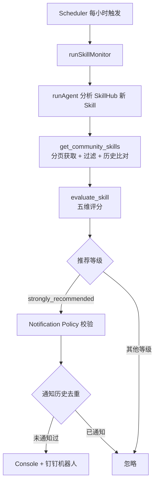

# SkillExplorer

SkillExplorer 是一个基于 **TypeScript + Node.js + OpenAI SDK** 构建的 Agent 项目，底层调用 **DeepSeek API**。

它有两种运行模式：对话模式下，它是一个可以读写文件、分析代码、执行命令的终端助手；定时探索模式下，它化身 SkillHub 社区探索器，自动发现新 Skill、评分并推送推荐。底层具备完整的 Agent Loop、工具调用、上下文管理与压缩、长期记忆、会话管理、命令安全控制与多渠道通知能力。

## 主要功能

### SkillHub 社区 Skill 探索与推荐（核心功能）

- **社区 Skill 发现** — 通过 SkillHub API 分页拉取社区 Skill，按 slug 去重、过滤无效数据，只处理历史中未出现过的新 Skill
- **五维评分与推荐** — 对每个新 Skill 由模型从实用性、通用性、社区热度、新颖性、安全性五个维度打分（0-10），计算总分并给出 `strongly_recommended` / `worth_watching` / `not_recommended` 推荐等级（安全分 ≤ 2 一票否决）
- **推荐推送** — 强烈推荐的 Skill 自动推送到 Console、钉钉机器人等渠道，通知内容含名称、slug、简介、分类、版本、总分、五维评分、主页；按 slug 去重，同一 Skill 不重复通知
- **定时监控** — 内置 Scheduler，每 60 分钟自动执行一轮「发现 → 评分 → 推送」监控任务

### 文件与代码助手

- **文件操作** — `read_file` / `write_file` / `list_files` / `search_files`：读取、写入、列目录、按内容关键词搜索文件
- **代码分析** — 结合 fileAnalysis 等 Skill，Agent 按规范流程阅读代码并输出分析结论
- **命令执行** — `run_command` 可执行命令，但须通过三级风险分级、工作区边界检查与 y/N 交互确认，危险命令会被直接拒绝

### 对话与记忆

- **多轮对话** — 同一 Session 内共享上下文，支持追问；会话持久化到本地文件，支持新建、切换、列出
- **长期记忆** — 任务结束后 Memory Agent 自动判断并保存值得长期记住的信息，下次对话自动带上
- **上下文压缩** — 上下文过长时自动压缩历史并保留最近消息，防止超出模型窗口

## 技术栈

- TypeScript（strict + nodenext + verbatimModuleSyntax）
- Node.js（`node:fs/promises`、`node:readline/promises`、`node:crypto` 等内置模块）
- OpenAI SDK（`openai` v7，兼容 DeepSeek API）
- DeepSeek API（模型 `deepseek-v4-pro`）
- `dotenv`（环境变量加载）、`tsx`（开发运行/测试运行器）
- 文件系统持久化（Memory、Session、Skill 历史、通知历史均为本地 JSON / Markdown 文件）

## 快速开始

### 环境变量

在项目根目录创建 `.env`（已加入 .gitignore，项目未提供 .env.example）：

| 变量 | 必填 | 说明 |
|---|---|---|
| `DEEPSEEK_API_KEY` | 是 | DeepSeek API Key |
| `WEBHOOK_URL` | 是（启动时校验） | 钉钉机器人 Webhook 地址 |

### 安装依赖

```bash
npm install
```

### 启动

项目有两个入口，对应两种运行模式：

```bash
# 入口一：对话模式 —— 启动终端交互式 Agent
npm run dev

# 入口二：定时探索模式 —— 每小时自动探索 SkillHub 社区新 Skill 并推送推荐
npm run monitor
```

也可以构建后运行编译产物（仅对话模式）：

```bash
npm run build
npm start
```

对话模式启动后会进入终端对话循环。普通输入发给 Agent，Agent 在终端打印执行轮次；`run_command` 等工具触发权限确认时按 `y/N` 应答。定时探索模式的执行流程见下文「定时监控」。

### CLI 命令

| 命令 | 说明 |
|---|---|
| `exit` | 退出程序 |
| `/new` | 创建新的 Session |
| `/sessions` | 列出所有已保存的 Session（序号、ID、创建时间、消息数） |
| `/switch <sessionId>` | 切换到指定 Session |

### 使用示例

```text
你：读取 src/index.ts，告诉我这个文件做了什么
Agent 第 1 轮：
Agent：
（read_file 结果分析……）

你：用 git status 看一下当前仓库状态
（run_command 触发权限确认）
是否确认执行？[y/N] y
```

## 整体架构与工作流程

### 主对话流程



### 社区 Skill 监控流程



## 核心模块

### Agent 核心（`src/agent/`）

`runAgent()` 是调度中心，核心常量：最大执行轮数 `MAX_TURNS = 10`，模型调用失败自动重试 `MAX_RETRIES = 3` 次（间隔 2 秒）。

每轮循环依次执行：压缩上下文 → 调用模型 → 截断检查 → Token 预算检查 → 若模型返回 Tool Call 则逐个执行并回填结果，若返回纯文本则视为最终答案。循环警告和 Token 警告会以 system 消息注入上下文，提示模型自我纠正；触发硬限制时直接终止并返回说明。

### 工具系统（`src/tools/`）

所有工具通过 `toolRegistry`（名称 → 处理函数的映射）统一注册，工具声明采用 OpenAI function calling schema 格式，由 `executeTool()` 按名称分发执行。工具异常不会中断主流程，而是包装为 `{ success: false, error }` 回传给模型。

| 工具名 | 实现文件 | 功能 |
|---|---|---|
| `read_file` | `tools/readFile.ts` | 读取指定文件内容 |
| `write_file` | `tools/writeFile.ts` | 向指定文件写入内容 |
| `list_files` | `tools/listFiles.ts` | 列出目录内容（目录名带 `/` 后缀） |
| `search_files` | `tools/searchFiles.ts` | 递归搜索目录中内容包含关键词的文件行 |
| `run_command` | `tools/runCommand.ts` | 执行命令（30 秒超时，须通过安全链路） |
| `get_community_skills` | `community/communityTool.ts` | 从 SkillHub 社区获取新 Skill |
| `evaluate_skill` | `community/skillScoring.ts` | 对社区 Skill 五维评分并给出推荐等级 |

### 命令安全控制（`src/security/`）

`run_command` 不会直接执行任意命令，而是经过三层检查：

1. **Command Policy**（`commandPolicy.ts`）— 按 `&&`、`;`、`|` 拆分命令链逐段评估，输出三级风险：
   - `safe`：直接执行
   - `confirm`：需用户确认（`git restore/clean/reset --hard/checkout --/rebase`、`push --force`、`rm/del/rmdir/mv/move`、输出重定向 `>`/`>>` 等）
   - `blocked`：直接拒绝（如 `format`）
2. **Workspace**（`workspace.ts`）— 工作区边界为进程当前目录；从命令中提取文件路径，任何越界路径都会使命令被拒绝
3. **Permission**（`permission.ts`）— `confirm` 级命令在终端弹出「是否确认执行？[y/N]」交互确认，拒绝则不执行

### Safety 保险丝（`src/safety/`）

| 模块 | 机制 | 触发条件 |
|---|---|---|
| 最大轮数（agent.ts） | 超出直接停止 | 单次任务执行满 10 轮 |
| Loop Detector | 「工具名 + 参数」生成指纹 | 同一调用第 2 次注入警告，第 3 次停止 |
| Token Budget | 预算 10000 tokens | 达 80% 提醒模型收尾，超预算停止 |
| Truncation Recovery | 注入提示后重新请求 | `finish_reason === "length"`，最多恢复 3 次 |

### Context 上下文管理（`src/context/`）

- `context.ts` — `createContext()` 创建初始上下文（System Prompt + Memory + 用户输入），`addMessage()` 追加消息
- `contextCompressor.ts` — 消息超过 10 条时压缩：旧消息交给模型生成摘要，保留最近 6 条。压缩前剥离 `reasoning_content` 字段，并保证 tool 消息不脱离对应的 `assistant.tool_calls`；压缩失败或结果包含非法 Tool 消息时回退原始上下文

注意：压缩只影响发送给模型的上下文，不会删除 Session 中的历史记录。

### Memory 长期记忆（`src/memory/`）

- `memoryManager.ts` — 基于 `src/memory/memory.md` 的 `loadMemory()` / `saveMemory()`
- `memoryAgent.ts` — 独立的 Memory Agent（最多 5 轮）。主 Agent 返回最终答案后，把任务、结果、当前 Memory、记忆管理 Skill 一起交给它，由它判断是否值得更新长期记忆，遵循「宁缺毋滥」原则
- `memoryTool.ts` — `write_memory` 工具的定义与执行

### Prompt 管理（`src/prompt/`）

- `systemPrompt.ts` — 系统提示词（Agent 身份、工具使用规则、Memory 参考原则）及循环警告、Token 警告文案
- `promptManager.ts` — 统一的 Prompt 获取接口，行为规则与核心代码分离

### Session 会话管理（`src/session/`）

- `session.ts` — `Session { sessionId, messages, createdAt }`，id 由 `randomUUID()` 生成
- `sessionManager.ts` — 保存/加载/列出会话，持久化到 `src/session/sessions/<sessionId>.json`（已加入 .gitignore）

### Skills 技能系统（`src/skills/`）

Skill 用 Markdown 描述某类任务的工作方法，主 Agent 启动时通过 `loadSkill()` 加载并注入 System Prompt，与「Agent 是谁」解耦。

| Skill | 用途 |
|---|---|
| `fileAnalysis.md` | 代码分析流程规范 |
| `memoryManagement.md` | 长期记忆维护规范（Memory Agent 使用） |
| `debugging.md` | 调试流程规范 |
| `testing.md` | 测试规范 |
| `git.md` | Git 操作风险分级与确认流程 |
| `communityRecommendation.md` | 社区 Skill 推荐分析流程 |

### SkillHub 社区 Skill 发现（`src/community/`）

- `communityTool.ts` — 通过 `GET https://api.skillhub.cn/api/skills` 分页获取社区 Skill（`pageSize` 默认 20、最多 100），每页按 slug 去重、过滤无效数据，跨页累计直到取满 10 个新 Skill 或列表耗尽。Skill 元数据包括：slug、name、description、description_zh、category、version、homepage、tags、downloads、stars 等
- `skillHistory.ts` — 已获取 Skill 的 slug 持久化到 `src/community/skillHistory.json`，只处理历史中未出现过的新 Skill

### Skill 评分与推荐（`src/community/skillScoring.ts`）

对每个社区 Skill 由模型进行五维评分（每维 0-10 分）：**实用性、通用性、社区热度、新颖性、安全性**。总分 = 五维直接求和，无权重。推荐等级判定：

| 等级 | 条件 |
|---|---|
| `strongly_recommended` | 总分 ≥ 39 且安全分 > 2 |
| `worth_watching` | 26 ≤ 总分 < 39 且安全分 > 2 |
| `not_recommended` | 其余情况 |

安全性有兜底机制：**安全分 ≤ 2 时一票否决**，即使总分再高也不推荐。

### 通知系统（`src/notification/`）

采用 Channel 抽象，`NotificationChannel` 接口只定义 `send(notification)`，`NotificationManager` 统一管理多个渠道并逐个广播，单渠道失败不影响其他渠道。

| 渠道 | 实现 | 说明 |
|---|---|---|
| Console | `consoleNotificationChannel.ts` | 终端格式化打印 |
| Webhook | `webhookNotificationChannel.ts` | POST JSON，默认 5 秒超时（AbortController），非 2xx 抛错。已实现并通过本地 mock 测试，当前入口未默认启用 |
| 钉钉机器人 | `dingTalkNotificationChannel.ts` | text 消息格式，校验 `errcode`，默认 5 秒超时。当前与 Console 一起默认启用 |

Skill 通知（`skillNotification.ts` + `skillNotificationService.ts`）：

- 仅 `strongly_recommended` 等级触发（`notificationPolicy.ts`）
- 通知内容包含：Skill 名称、slug、简介（`description_zh` 优先，无中文时用 `description`）、分类、版本、推荐总分、推荐等级、五维评分、主页
- 去重（`notificationHistory.ts`）：按 skillSlug 记录已通知历史，持久化到 `src/notification/notificationHistory.json`，同一 Skill 不重复推送

### 定时监控（`src/scheduler/`）

- `scheduler.ts` — 通用调度器：`createScheduler({ intervalMs, task })` 返回 `{ start, stop }`；启动后立即执行一次，之后按间隔循环；带 `isRunning` 防并发机制（上一任务未结束时跳过本次）
- `monitorScheduler.ts` — 每 **60 分钟**执行一次 `runSkillMonitor`；监听 SIGINT 优雅退出。通过 `npm run monitor` 启动（对应 `tsx src/scheduler/monitorScheduler.ts`）

## 项目目录结构

```text
src/
├── index.ts                  # 程序入口：终端交互 + 通知服务装配
├── agent/
│   └── agent.ts              # 主 Agent：Agent Loop 调度中心
├── context/
│   ├── context.ts            # 上下文创建与消息追加
│   └── contextCompressor.ts  # 上下文压缩
├── memory/
│   ├── memory.md             # 长期记忆文件
│   ├── memoryManager.ts      # Memory 读写
│   ├── memoryAgent.ts        # Memory Agent
│   └── memoryTool.ts         # write_memory 工具
├── prompt/
│   ├── systemPrompt.ts       # 提示词文案
│   └── promptManager.ts      # 提示词获取接口
├── safety/
│   ├── loopDetector.ts       # 重复调用检测
│   ├── tokenBudget.ts        # Token 预算控制
│   └── truncationRecovery.ts # 输出截断恢复
├── security/
│   ├── commandPolicy.ts      # 命令风险分级
│   ├── permission.ts         # 用户确认交互
│   └── workspace.ts          # 工作区边界检查
├── session/
│   ├── session.ts            # Session 定义与创建
│   ├── sessionManager.ts     # 持久化与管理
│   └── sessions/             # 会话数据（gitignore）
├── skills/
│   ├── fileAnalysis.md       # 代码分析 Skill
│   ├── memoryManagement.md   # 记忆管理 Skill
│   ├── debugging.md          # 调试 Skill
│   ├── testing.md            # 测试 Skill
│   ├── git.md                # Git 操作 Skill
│   ├── communityRecommendation.md  # 社区推荐分析 Skill
│   └── loadSkill.ts          # Skill 加载
├── tools/
│   ├── toolRegistry.ts       # 工具统一注册
│   ├── readFile.ts           # read_file 工具
│   ├── writeFile.ts          # write_file 工具
│   ├── listFiles.ts          # list_files 工具
│   ├── searchFiles.ts        # search_files 工具
│   └── runCommand.ts         # run_command 工具
├── community/
│   ├── communityTool.ts      # SkillHub 查询工具
│   ├── skillHistory.ts       # 已获取 Skill 历史（gitignore）
│   ├── skillMonitor.ts       # SkillHub 监控任务
│   └── skillScoring.ts       # Skill 评分与推荐
├── scheduler/
│   ├── scheduler.ts          # 通用定时器
│   └── monitorScheduler.ts   # 监控任务调度入口
├── notification/
│   ├── notification.ts           # 通知数据结构
│   ├── notificationChannel.ts    # Channel 抽象接口
│   ├── notificationManager.ts    # 多渠道管理
│   ├── consoleNotificationChannel.ts     # Console 渠道
│   ├── webhookNotificationChannel.ts     # Webhook 渠道
│   ├── dingTalkNotificationChannel.ts    # 钉钉渠道
│   ├── skillNotification.ts      # Skill 通知构建
│   ├── skillNotificationService.ts       # Skill 通知服务
│   ├── notificationPolicy.ts     # 通知策略
│   └── notificationHistory.ts    # 通知去重历史（gitignore）
└── tests/                    # 测试脚本（25 个）
```

## 测试方式

项目没有引入测试框架（无 jest/vitest），测试是**用 tsx 直接运行的独立脚本**：脚本内部用 `throw` 或输出 `✓/✅` 判定，失败时设置 `process.exitCode = 1`。

```bash
# package.json 未提供聚合的 test 脚本，所有测试均逐个运行，例如：
npx tsx src/tests/security-test.ts
npx tsx src/tests/session-test.ts
npx tsx src/tests/skillScoring-test.ts
npx tsx src/tests/notificationDedup-test.ts
```

`src/tests/` 下共 25 个测试脚本，覆盖：Agent/Tool、命令安全、权限确认、工作区边界、Session、社区 Skill、Skill 历史、Skill 评分、Scheduler、监控任务、通知管理、多渠道、通知去重、通知策略、通知服务、Webhook（含超时/异常场景）等。

注意：部分测试需要真实外部服务——`community-test`、`skillMonitor-test`、`monitorScheduler-test` 需要访问 SkillHub API；`dingtalkNotification-test`、`webhookReal-test` 需要真实 Webhook；Webhook 渠道的 mock 测试（error/timeout/正常）只在本机 localhost 端口启动临时服务器，不访问外网。

## 开发历程

- **2026-08-28 ~ 08-31** — 项目起步：初始化并接入 DeepSeek，实现 `read_file` 工具与 Tool Result 回传，终端可对话。
- **2026-09-01 ~ 09-02** — 核心架构成型：Agent Loop（while + 多 ToolCall + 最大轮数）、四道保险丝（轮数/死循环检测/Token 预算/截断恢复）、Prompt 管理、Skill 加载、Memory 模块与 Memory Agent、Session 雏形、上下文压缩接入主流程。
- **2026-09-03** — 工具与 Skill 扩展：`toolRegistry` 统一注册，新增 `list_files`、`search_files`、`run_command` 工具与 Debugging/Testing Skill，优化 Memory 保存策略。
- **2026-09-04** — 安全与会话：命令三级风险策略、权限确认、工作区边界检查与安全测试；Session 持久化与多会话管理（`/new`、`/sessions`、`/switch`）；新增 Git Skill。
- **2026-09-07** — 社区 Skill 体系：SkillHub 查询工具、筛选与历史持久化、只处理新 Skill、五维评分与推荐规则、定时监控（Scheduler 防并发与生命周期控制）、通知基础架构。
- **2026-09-08** — 通知系统完善：多渠道架构（Console/Webhook/钉钉）、通知去重与历史持久化、钉钉机器人接入、真实 Webhook 联调、评分阈值调整、多页筛选优化、推送内容增加 Skill 简介。

## 未来规划

以下方向尚未实现，仅作规划：

- 钉钉通知加签与 @ 成员提醒
- Webhook 渠道接入默认通知链路
- 通知渠道扩展（邮件、Telegram 等）
- Skill 评分规则提示词外置与可配置化
- 社区 Skill 本地化存储与检索
- Memory 向量化检索（RAG）
- 上下文压缩策略进一步智能化
- Web UI / 多 Agent 协作
